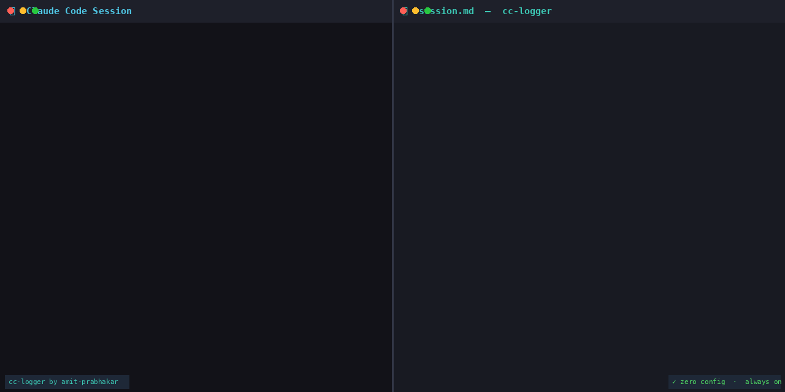

# cc-logger — Claude Code Session Logger

> Every tool call Claude makes, captured — Markdown + JSON audit logs, automatically, for every session.


---



---

## Why cc-logger?

You use Claude Code every day. Tomorrow, you'll have no idea what it did.

- **Which files did it touch?** Shell history won't tell you.
- **What commands did it run?** Scrolled off the terminal.
- **Did it make that change to auth.ts before or after the test run?** Unknown.

cc-logger fixes this. It attaches to Claude Code's `PostToolUse` hook and writes a structured log of every tool call — automatically, with zero configuration, in a format you'll actually want to read.

---

## What you get

After every Claude Code session, a new folder appears in `./logs/`:

```
logs/
└── 20260525_093015_a3f9b2e1/
    ├── session.md    ← human-readable, renders on GitHub
    └── session.json  ← machine-readable, schema versioned
```

**session.md** — open it, and your entire session is right there:

```markdown
# cc-logger Session · 2026-05-25 09:30:15 UTC

| Field | Value |
|-------|-------|
| Session ID | `a3f9b2e1...` |
| Working Dir | `/Users/amit/projects/api-server` |

---

## [09:30:45] ⚡ Bash · Call #1
**Command:** `git log --oneline -5`

<details><summary>Output (5 lines) · exit 0</summary>

```
abc1234 feat: add oauth refresh
def5678 fix: token expiry edge case
```
</details>

## [09:31:18] ✏️ Edit · Call #2
**File:** `src/auth/token.ts`

<details><summary>Edit diff</summary>

```diff
- const token = jwt.sign(payload, secret)
+ const token = await generateSecureToken(payload)
```
</details>
```

**session.json** — for CI pipelines, dashboards, and scripts:

```json
{
  "schema_version": "1",
  "session_id": "a3f9b2e1-...",
  "started_at": "2026-05-25T09:30:15Z",
  "tool_calls": [
    { "index": 1, "tool": "Bash", "input": { "command": "git log --oneline -5" }, "response": { "exit_code": 0, "output_lines": 5 } },
    { "index": 2, "tool": "Edit", "input": { "file_path": "src/auth/token.ts" }, "response": {} }
  ],
  "summary": { "total_tool_calls": 7, "files_modified": ["src/auth/token.ts"], "commands_run": ["git log --oneline -5", "npx tsc --noEmit"] }
}
```

---

## Install in 2 minutes

### Option A — Global install ⭐ (recommended)

One install. Every Claude Code session on your machine — terminal, VS Code, Cursor, any project — logs automatically.

**macOS / Linux:**
```bash
curl -fsSL https://raw.githubusercontent.com/amit-prabhakar01/cc-logger/main/install.sh | sh -s -- --global
```

**Windows (PowerShell):**
```powershell
iwr -useb https://raw.githubusercontent.com/amit-prabhakar01/cc-logger/main/install.ps1 | iex
```

Logs land in a central folder, organised by project:

```
~/.cc-logger/                          # macOS / Linux
%USERPROFILE%\.cc-logger\             # Windows
├── api-server_a3f9b2e1/               # project name + path hash
│   ├── 20260527_143022_xxx/
│   │   ├── session.md
│   │   └── session.json
│   └── 20260528_091544_yyy/
├── frontend-app_c4d5e6f7/
└── cc-logger-index.json               # maps folder names → full project paths
```

**Config hierarchy** — global defaults, per-project overrides:

```
~/.claude-logger.json                  # machine-wide defaults
<project>/.claude-logger.json         # override for that project only
```

**Custom log location** — add `centralLogDir` to `~/.claude-logger.json`:

```json
{
  "centralLogDir": "~/Documents/claude-logs"
}
```

---

### Option B — Project install

Logs only sessions in the current project. Logs land in `./logs/` inside the project folder.


```bash
curl -fsSL https://raw.githubusercontent.com/amit-prabhakar01/cc-logger/main/install.sh | sh
```

That's it. The project installer:
- Copies the hook script to `.claude/hooks/log_session.py`
- Merges the hook into `.claude/settings.json` (backs up existing config first)
- Adds `logs/` to `.gitignore`
- Creates `.claude-logger.json` with sensible defaults

**Next Claude Code session you run, logs appear in `./logs/` automatically.**

### Manual install (if you prefer to review before running)

```bash
# 1. Clone or download
git clone https://github.com/amit-prabhakar01/cc-logger
cd your-project

# 2. Copy the hook script
mkdir -p .claude/hooks
cp /path/to/cc-logger/.claude/hooks/log_session.py .claude/hooks/

# 3. Register the hook in .claude/settings.json
# Add this to your existing hooks, or create a fresh file:
```

```json
{
  "hooks": {
    "PostToolUse": [
      {
        "matcher": "*",
        "hooks": [
          {
            "type": "command",
            "command": "python3 ${CLAUDE_PROJECT_DIR}/.claude/hooks/log_session.py"
          }
        ]
      }
    ]
  }
}
```

### Requirements

- Python 3.8+
- Claude Code (any recent version)
- Works on macOS, Linux, Windows (WSL)

### Using cc-logger with the Claude Code VS Code extension

cc-logger works with the VS Code extension — no extra setup required. Hooks are part of Claude Code's runtime engine, not the terminal interface, so they fire on every tool call whether you're in the terminal or inside VS Code.

**One thing to check on Windows (non-WSL):** The hook command uses `python3`. If your system only has `python` in PATH (common on Windows), update the command in `.claude/settings.json`:

```json
"command": "python ${CLAUDE_PROJECT_DIR}/.claude/hooks/log_session.py"
```

**Where logs appear:** Logs are always written relative to the project root — the folder you have open in VS Code. Look for `./logs/` inside your workspace folder after the first session.

**Tip:** The VS Code file explorer will show new log folders appearing in `logs/` in real time as Claude works. Open `session.md` in the VS Code Markdown preview for a formatted view of the session as it builds.

---

## Configuration

Drop a `.claude-logger.json` in your project root to customize:

```json
{
  "enabled": true,
  "filtering": {
    "excludeTools": ["Read", "Glob", "Grep"],
    "includeTools": []
  },
  "output": {
    "maxInlineChars": 3000,
    "minToolCallsToWrite": 1
  }
}
```

| Option | Default | Description |
|--------|---------|-------------|
| `enabled` | `true` | Turn logging on/off without uninstalling |
| `excludeTools` | `["Read", "Glob", "Grep"]` | Tools to skip (reduces noise) |
| `includeTools` | `[]` | If non-empty, ONLY log these tools |
| `maxInlineChars` | `3000` | Truncate long outputs to this length |
| `minToolCallsToWrite` | `1` | Minimum calls before writing a session file |

**Config presets** — swap in for different workflows:

```bash
cp config/minimal.json .claude-logger.json  # timeline only, no content
cp config/verbose.json .claude-logger.json  # everything, including Read
```

---

## Security & privacy

**Sensitive data is always redacted.** Before anything is written to disk, cc-logger scrubs:

- API keys and secrets (`api_key=...`, `secret=...`, `token=...`)
- Bearer tokens (`Authorization: Bearer ...`)
- GitHub PATs (`ghp_...`), Slack tokens (`xoxb-...`), OpenAI keys (`sk-...`)
- Long base64 strings (likely secrets)

This cannot be disabled. The patterns can be extended (not removed) in `log_session.py`.

**What cc-logger does and does not capture:**

| Captured | Not captured |
|----------|-------------|
| Tool call inputs and outputs (Bash commands, file edits, etc.) | Your conversation — prompts and Claude's responses are never in the hook payload |
| Working directory path (contains your OS username, e.g. `/Users/amit/projects/...`) | Anthropic account details — no email, login, or subscription info |
| Git branch and HEAD commit at session start | Claude Code authentication tokens |
| Timestamps and session duration | Any data not produced by a tool call |

> **Note for teams:** Session logs contain working directory paths, which typically include the OS username of whoever ran the session. If you are logging to a shared location (e.g. a committed `logs/` folder in a team repo), be aware that paths like `/Users/amit/projects/api-server` will be visible to anyone with repo access. The `logs/` directory is added to `.gitignore` by default — this is intentional.

**Escape hatch** — for sessions where you're working with credentials directly:

```bash
export NO_CC_LOGS=1
claude   # this session is not logged
unset NO_CC_LOGS
```

---

## Real-world use cases

**Post-incident forensics** — Production broke after a Claude session. Open the session log. Every file it touched, every command it ran, in order, with timestamps. No guessing.

**PR review augmentation** — Reviewer opens `session.md` alongside the diff. They see not just what changed but the sequence: which searches led to which edits, which tests ran between changes.

**Compliance audit trails** — Regulated environment requiring human oversight of AI-generated code. Session logs document the scope of AI involvement with timestamps.

**Personal retrospectives** — End-of-week review: which tasks consumed the most Claude time, where did sessions stall, what prompting patterns produced the best results.

**Cost accountability** — Parse `session.json` summaries to understand Claude usage by project or task type before scaling team licenses.

---

## Example logs

See [`examples/sessions/`](examples/sessions/) for real-looking session logs:

- [`refactor-auth-module/`](examples/sessions/refactor-auth-module/) — JWT → session-based auth refactor (7 tool calls)
- [`debug-api-timeout/`](examples/sessions/debug-api-timeout/) — Production timeout root-cause investigation (5 tool calls)

---

## Roadmap

### v1.0 — Shipped ✅
- [x] PostToolUse hook — per-call Markdown + JSON logging
- [x] Stop hook — session summary (duration, files modified, commands run, git delta)
- [x] Git state snapshot (branch, HEAD, dirty file count) at session start
- [x] Always-on sensitive data redaction (API keys, tokens, PATs, AWS keys)
- [x] `minToolCallsToWrite`, `excludeTools`, `includeTools` config options
- [x] `NO_CC_LOGS=1` escape hatch

### v1.1 — High value
- [ ] File diffs inline in Edit/Write entries
- [ ] Token and cost estimation in session summary
- [ ] Webhook on session end (Slack, Notion, custom HTTP)
- [ ] Log rotation policies (max sessions, max age)

### v2.0 — Platform
- [ ] `claude-logs` CLI: `show`, `search`, `cost --week`, `export`
- [ ] Local-first web dashboard (`claude-logs serve`)
- [ ] VS Code extension sidebar panel
- [ ] AI-generated session narrative (opt-in)

[Open an issue](https://github.com/amit-prabhakar01/cc-logger/issues) to vote on features or suggest new ones.

---

## Contributing

Contributions are welcome. Please read the checklist in [PULL_REQUEST_TEMPLATE.md](.github/PULL_REQUEST_TEMPLATE.md) before opening a PR.

**Good first issues:**
- Add JSON export format alongside Markdown
- Add Obsidian-compatible front matter to log files
- Write a PowerShell install script for Windows
- Document monorepo usage patterns

```bash
# Development setup
git clone https://github.com/amit-prabhakar01/cc-logger
cd cc-logger
make test     # run tests
make lint     # check code style
```

---

## Community

Built something interesting with cc-logger? [Share your session log](https://github.com/amit-prabhakar01/cc-logger/issues/new?template=share_your_log.yml) — real-world examples help others see the value.

If you write about cc-logger, open an issue with the link and we'll add it here.

---

## License

MIT — see [LICENSE](LICENSE).

---

*Built with [Claude AI](https://claude.ai) · Powered by [Claude Code](https://claude.ai/code) · Logged with cc-logger.*

> This entire repository — architecture, hook script, tests, installer, and documentation — was designed and built using Claude AI. Every session was logged with cc-logger itself.
